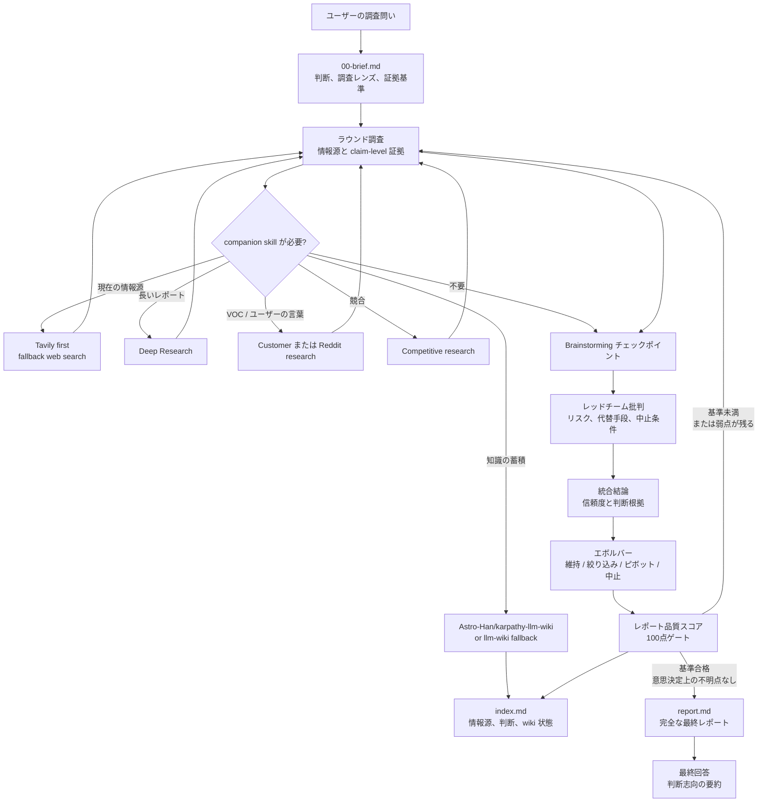

# Super Survey

言語: [English](README.md) | [中文](README.zh-CN.md) | 日本語

Super Survey は、プロダクト、市場、技術、オープンソース調査のための再利用可能な agent skill 兼調査ワークフローです。曖昧な調査対象を、証拠、レッドチーム批判、統合判断、次回のより具体的な問いを含む Markdown 成果物に変換します。Skills 互換の agent 向けに設計されており、同梱 CLI から直接使うこともできます。

## 概要

Super Survey は、リンク集で終わらせるべきではない意思決定に向いています:

- プロダクト機会の調査
- 競合・市場分析
- オープンソースプロジェクトの調査
- 技術的実現可能性の確認
- 投資・デューデリジェンス型の調査
- 反対意見を含む戦略検討

各調査では次の成果物を作成します:

```text
surveys/YYYY-MM-DD-topic-slug/
├── 00-brief.md
├── 01-research.md
├── 01-brainstorm.md
├── 01-redteam.md
├── 01-synthesis.md
├── 01-evolver.md
├── sources.jsonl
├── claims.jsonl
├── evidence.jsonl
├── index.md
├── report.md
└── .super-survey.json
```

## インストール

Skills CLI で直接インストールします:

```bash
npx skills add GoatGit/super-survey
```

Codex ユーザーは Codex skills ディレクトリへコピーすることもできます:

```bash
mkdir -p ~/.codex/skills
rsync -a --delete super-survey/ ~/.codex/skills/super-survey/
```

明示的に呼び出します:

```text
$super-survey AI採用エージェントが作る価値のある機会か調査して
```

## CLI

調査を作成:

```bash
python3 scripts/survey_round.py init "AI recruiting agent" --language en
python3 scripts/survey_round.py init "AI 招聘助手" --language zh
python3 scripts/survey_round.py init "AI採用エージェント" --language ja
python3 scripts/survey_round.py init "formal market report" --mode deep
```

ラウンドを作成して検証:

```bash
python3 scripts/survey_round.py round surveys/2026-06-13-ai採用エージェント 1
python3 scripts/survey_round.py validate-evidence surveys/2026-06-13-ai採用エージェント
python3 scripts/survey_round.py check surveys/2026-06-13-ai採用エージェント
python3 scripts/survey_round.py upgrade-report surveys/2026-06-13-ai採用エージェント
```

`check` は、必要ファイルの欠落、見出しの欠落、必須セクションの空欄、空テンプレートのままの成果物、証拠レジストリのリンク不備、prose-first ルール違反、または v2 レポートに解析可能な品質スコアがない場合に失敗します。`validate-evidence` は `sources.jsonl`、`claims.jsonl`、`evidence.jsonl` を直接検証します。ラウンド番号は正の整数である必要があります。古い 6 セクションのレポートは warning 付きで互換扱いになります。`upgrade-report` を実行すると完全な report schema が追加されるため、新しいセクションを埋めてください。

## モードと証拠レジストリ

速度または厳密さが重要な場合は、深さを明示的に選びます:

| モード | 用途 | 最低レジストリ要件 | レポートゲート |
|---|---|---:|---|
| `quick` | 方向性の確認や初期トリアージ | 1 情報源、1 主張、1 証拠 | スコア >=80 |
| `standard` | 既定の再利用可能な調査レポート | 3 情報源、3 主張、3 証拠 | スコア >=90 |
| `deep` | 公式/高リスクレポート、多数の引用、厳密な監査 | 8 情報源、6 主張、8 証拠 | スコア >=95 |

軽量な証拠レジストリは、本文の読みやすさを保ちながら監査可能性を残します:

- `sources.jsonl`: `source_id`, `title`, `url`, `source_type`, `date_checked`, `credibility`
- `evidence.jsonl`: `evidence_id`, `source_id`, `quote_or_summary`, `locator`, `confidence`
- `claims.jsonl`: `claim_id`, `claim`, `supporting_evidence_ids`, `status`

すべての evidence は既存の source を参照する必要があります。supported、partial、contested の claim は既存の evidence を参照する必要があります。密な証拠表は本文ではなく、付録または JSONL に置きます。

## skills.sh 収録準備

このリポジトリは、Skills CLI の発見と skills.sh のインデックスに向けた構成になっています:

- ルート階層の `SKILL.md` に `name` と `description` frontmatter を配置
- `agents/openai.yaml` の UI メタデータ
- `scripts/` 配下の補助スクリプト
- `references/` 配下の参考資料
- MIT ライセンス、テスト、多言語 README ファイル

発見できることを検証:

```bash
npx skills add GoatGit/super-survey --list
```

## 品質ゲート

完了したラウンドには次が必要です:

- 現在の調査対象と判断基準
- 情報源選定を導く調査レンズと判断に必要な証拠基準。ただし狭いカテゴリに固定しない
- 情報源タイプ、鮮度、信頼度、矛盾する証拠、使用した検索ツールを含む claim-level の証拠
- brainstorming チェックポイント
- 発見と解釈の分離
- 代替手段、代替説明、確認済みの中止条件を含むレッドチーム批判
- 信頼度、判断根拠、未解決事項を含む統合結論
- `維持 / 絞り込み / ピボット / 中止` を明示した軽量エボルバー出力
- 明示的な継続/停止判断。ただし固定ラウンド数ではなくレポート品質スコアで判断する
- wiki または graph インデックス状態を記録した更新済み `index.md`
- 完全な最終レポートとして独立した `report.md`。読みやすい本文を先に置き、証拠、情報源、方法、レッドチーム、シナリオなどの監査材料は付録に置く

`report.md` は 100 点の品質ゲートを使います:

| 観点 | 点数 |
|---|---:|
| 問題と範囲の定義 | 15 |
| 情報源と方法の品質 | 20 |
| 証拠の完全性 | 20 |
| 分析とレッドチームの品質 | 20 |
| 実行可能性 | 15 |
| 構成と読みやすさ | 10 |

`>=90` は、desk research で減らせる意思決定上の不明点が残っていない場合に最終化できます。`80-89` は条件付きで、追加の desk research が判断を変えない理由を明記する必要があります。`<80` は最低スコア領域に焦点を当てて次のラウンドを続けます。

最終レポートは監査表ではなく、人が読み通せる判断メモとして書きます。本文では結論、読み方、主要な物語、判断ロジック、最終推奨、結論を変える条件、次の行動、レポートの範囲を先に示します。証拠レジスター、情報源品質、レッドチームメモ、シナリオ、品質スコア、情報源一覧は付録に置き、厳密さと読みやすさを両立させます。

エボルバーはレポート品質スコアの前に実行します。これはラウンド単位の工程で、最新の統合結論とレッドチーム批判を `維持 / 絞り込み / ピボット / 中止` と、より鋭い次回ラウンドの焦点に変換します。品質スコアはレポート単位のゲートで、更新後の `report.md` に対してのみ付けます。スコアが不合格の場合、次のラウンドはレポートの最低スコア領域とエボルバーの焦点を入力にします。

完了した各調査ラウンドでは wiki への永続化を必ず試みます。優先は `karpathy-llm-wiki` / `Astro-Han/karpathy-llm-wiki`、次にローカル `llm-wiki`、プロジェクト設定がある場合は `pin-llm-wiki`、その後に他の indexer、最後に Markdown-only の `index.md` です。`index.md` には `Wiki Tool Attempted`、`Wiki Ingest Result`、`Wiki Fallback Reason`、`Wiki Artifact Path` を記録します。

Super Survey は、検索、深いレポート作成、VOC/顧客調査、競合分析、brainstorming、wiki への蓄積などのサブタスクを任意の companion skills にルーティングできます。現在の情報源発見では `tavily-search` を先に試し、fallback があれば記録します。これらの companion は証拠の収集や整形を担当し、最終的な判断ループは Super Survey が担います。

ユーザーが正式な長文レポート、多数の引用、HTML/PDF 出力、厳密な citation 検証、または公開向けの情報源監査を求める場合、`deep-research` が優先 companion です。この場合、deep-research は証拠の永続化と長文レポート包装を担当し、Super Survey はレッドチーム批判、エボルバー判断、最終的な意思決定の収束を担当します。

## 呼び出しフロー



## インスピレーション: Karpathy の autoresearch

Super Survey の軽量エボルバーは、敬意と帰属を込めて Andrej Karpathy の [autoresearch](https://github.com/karpathy/autoresearch) から着想を得ています。autoresearch の中心的な考え方は、AI agent に実際の学習環境を与え、コードを変更させ、短い実験を走らせ、指標が改善したかを確認し、変更を保持または破棄して反復することです。

Super Survey は、このループをプロダクト、市場、技術、オープンソース調査向けに適用しています:

| 観点 | Karpathy autoresearch | Super Survey エボルバー |
|---|---|---|
| 目的 | 実験を通じてモデルまたはコードを改善する | 調査仮説を実行可能な判断へ近づける |
| 入力 | 学習コード、固定評価、実験ログ | 証拠、情報源、制約、レッドチーム批判 |
| フィードバック | validation loss など比較可能な単一指標 | 証拠の強さ、リスク、信頼度にもとづく構造化判断 |
| 判断 | コード変更を保持または破棄する | 仮説を維持、絞り込み、ピボット、または中止する |
| 出力 | 改善されたコード/モデルと実験履歴 | より絞られた次回調査目標と必要な証拠 |

要するに、autoresearch は指標駆動の最適化であり、Super Survey は判断駆動の絞り込みです。調査対象に明確な benchmark がある場合、Super Survey は autoresearch に近い形を取れます。一方で、買い手の意欲、コンプライアンス、流通、戦略リスクが中心の問いでは、すべてを一つの数値に還元したふりをせず、証拠優先かつ意思決定志向のループを保ちます。

## 開発

テストを実行:

```bash
python3 -m unittest discover -v
```

構文チェック:

```bash
python3 -m py_compile scripts/survey_round.py
```

実行時依存は Python 標準ライブラリのみです。

## プロジェクト構成

```text
SKILL.md                         # agent skill 指示
scripts/survey_round.py           # 調査成果物の生成・検証 CLI
references/lightweight-evolver.md # 軽量エボルバーの手順
references/research-quality.md    # 証拠品質リファレンス
agents/openai.yaml                # スキル UI メタデータ
tests/                            # 回帰テスト
```

## ライセンス

MIT。詳しくは [license.txt](license.txt) を参照してください。
