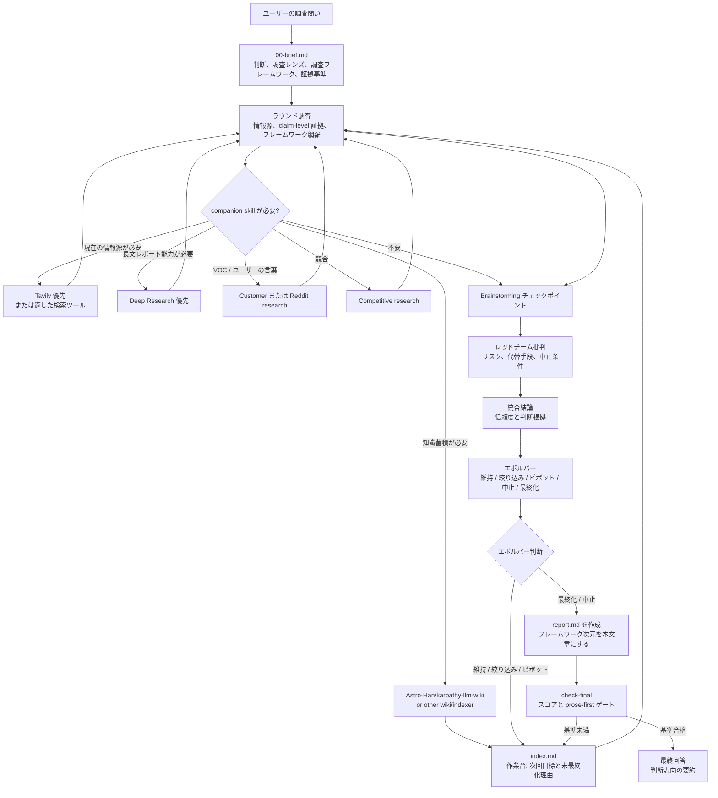

# Super Survey

言語: [English](README.md) | [中文](README.zh-CN.md) | 日本語

Super Survey は、プロダクト、市場、技術、オープンソース調査のための再利用可能な agent skill です。曖昧な調査対象を、証拠、レッドチーム批判、統合判断、次回のより具体的な問いを含む Markdown 成果物に変換します。Skills 互換の agent 向けに設計されており、同梱 CLI から直接使うこともできます。

主に次の 3 つを担います:

- 曖昧な問いを実行可能な調査フレームに変える。
- 証拠、レッドチーム批判、統合判断によって思い込みの結論を減らす。
- 各ラウンドの終わりに、より鋭い次回の問いまたは最終レポートを出す。

## 第一原理

1. 世界はランダムでノイズが多く、初期の直感から確実に予測できるものではありません。すべての調査タスクは、「先に結論を決め、その結論を支える証拠を集める」罠を避けなければなりません。
2. 調査レポートは、人間の意思決定者に向けた判断レポートであり、agent のタスク監査ログではありません。証拠経路、情報源レジストリ、レッドチームメモ、品質チェックは必要ですが、それらは読みやすい判断を支えるものであり、判断そのものを置き換えるものではありません。
3. ユーザーの問いは出発点であり、目的関数ではありません。Super Survey は、証拠を探したり結論へ収束したりする前に、ユーザーのフレーミング、暗黙の仮定、本当に最適化すべき目標を点検します。

## 概要

Super Survey は、リンク集で終わらせるべきではない意思決定に向いています:

- プロダクト機会の調査
- 競合・市場分析
- オープンソースプロジェクトの調査
- 技術的実現可能性の確認
- 投資・デューデリジェンス型の調査
- 反対意見を含む戦略検討

各調査では次の成果物を作成します:

```text
surveys/YYYY-MM-DD-topic-slug/
├── 00-brief.md
├── 01-research.md
├── 01-brainstorm.md
├── 01-redteam.md
├── 01-synthesis.md
├── 01-evolver.md
├── sources.jsonl
├── claims.jsonl
├── evidence.jsonl
├── index.md
├── report.md              # final-only; 停止ゲート通過後に作成
└── .super-survey.json
```

## インストール

Skills CLI で直接インストールします:

```bash
npx skills add GoatGit/super-survey
```

Codex ユーザーは Codex skills ディレクトリへコピーすることもできます:

```bash
mkdir -p ~/.codex/skills
rsync -a --delete super-survey/ ~/.codex/skills/super-survey/
```

明示的に呼び出します:

```text
$super-survey AI採用エージェントが作る価値のある機会か調査して
```

## CLI

調査を作成:

```bash
python3 scripts/survey_round.py init "AI recruiting agent" --language en
python3 scripts/survey_round.py init "AI 招聘助手" --language zh
python3 scripts/survey_round.py init "AI採用エージェント" --language ja
python3 scripts/survey_round.py init "formal market report" --mode deep
```

ラウンドを作成して検証:

```bash
python3 scripts/survey_round.py round surveys/2026-06-13-ai採用エージェント 1
python3 scripts/survey_round.py check surveys/2026-06-13-ai採用エージェント
python3 scripts/survey_round.py check-final surveys/2026-06-13-ai採用エージェント
python3 scripts/survey_round.py upgrade-report surveys/2026-06-13-ai採用エージェント
```

証拠レジストリのリンクだけを直接デバッグ:

```bash
python3 scripts/survey_round.py validate-evidence surveys/2026-06-13-ai採用エージェント
```

コマンドの意味:

- `check`: ラウンド成果物、`index.md`、証拠レジストリ、companion routing 記録、最新エボルバーの生判断を検証します。`report.md` は要求しません。
- `check-final`: `check` の内容に加えて、最終 `report.md`、prose-first ルール、`index.md` に記録されたモード別品質スコア、最新エボルバー判断が `最終化` または `中止` であることを検証します。
- `upgrade-report`: 古いレポートに完全な report schema を追加します。古い 6 セクションのレポートは読めますが final gate は通過できません。アップグレード後は新しいセクションを埋めてください。
- `validate-evidence`: `sources.jsonl`、`claims.jsonl`、`evidence.jsonl` の直接デバッグ専用です。通常のラウンド検証は `check` / `check-final` を使います。

最新判断が `維持`、`絞り込み`、または `ピボット` の場合、`check` は継続 warning 付きで成功できます。これにより、早すぎる `中止` を誘導せず次ラウンドへ進めます。ラウンド番号は正の整数である必要があります。

## モードと証拠レジストリ

速度または厳密さが重要な場合は、深さを明示的に選びます:

| モード | 用途 | 最低レジストリ要件 | レポートゲート |
|---|---|---:|---|
| `quick` | 方向性の確認や初期トリアージ | 1 情報源、1 主張、1 証拠 | スコア >=80 |
| `standard` | 既定の再利用可能な調査レポート | 3 情報源、3 主張、3 証拠 | スコア >=90 |
| `deep` | 公式/高リスクレポート、多数の引用、厳密な監査 | 8 情報源、6 主張、8 証拠 | スコア >=95 |

`quick` モードでは、`NN-round.md` が今回の調査問い、証拠と情報源、brainstorming チェックポイント、レッドチーム、統合結論、生判断、次の行動を含む場合、5 つの分割ラウンド成果物を置き換えられます。

軽量な証拠レジストリは、本文の読みやすさを保ちながら監査可能性を残します:

- `sources.jsonl`: `source_id`, `title`, `url`, `source_type`, `date_checked`, `credibility`
- `evidence.jsonl`: `evidence_id`, `source_id`, `quote_or_summary`, `locator`, `confidence`
- `claims.jsonl`: `claim_id`, `claim`, `supporting_evidence_ids`, `status`

すべての evidence は既存の source を参照する必要があります。supported、partial、contested の claim は既存の evidence を参照する必要があります。チェッカーは重複 ID と、supported/partial claim がリンク先 evidence と明らかに対応していない弱い支援関係も検出します。密な証拠表は本文ではなく、付録または JSONL に置きます。

`C1`、`E1` のような registry ID は作業ファイル用です。最終 `report.md` では、それらを情報源タイトル、Markdown リンク、脚注、または URL を含む付録参照に置き換え、JSONL レジストリを開かなくても読める形にします。

## skills.sh 収録準備

このリポジトリは、Skills CLI の発見と skills.sh のインデックスに向けた構成になっています:

- ルート階層の `SKILL.md` に `name` と `description` frontmatter を配置
- `agents/openai.yaml` の UI メタデータ
- `scripts/` 配下の補助スクリプト
- `references/` 配下の参考資料
- MIT ライセンス、テスト、多言語 README ファイル

発見できることを検証:

```bash
npx skills add GoatGit/super-survey --list
```

## 調査フレームワーク

`調査レンズ` はどの証拠を重視するかを決めます。`調査フレームワーク` は、調査全体がどの方法で問いを体系的に検討したかを読者に示します。各調査では、採用したフレームワーク、次元、弱い次元、意図的に除外した次元を明記し、その次元を `00-brief.md`、各ラウンド成果物、最終レポートの共通構造として使います。

フレームワークを選ぶ前に、反迎合のフレーミング確認を行います。ユーザーの表現を、既知の事実、未検証の仮定、主観的判断、欠落情報、主要ステークホルダーに分け、そのうえで目的を意思決定の言葉に置き直します。これにより、ユーザーの初期表現、より中止しやすい強い命題、または耳ざわりは良いが本当の判断に答えない結論へ最適化することを防ぎます。

最重要の記述ルールは、フレームワークを最後に付ける監査チェックリストにしないことです。`00-brief.md` が次元を定義し、`NN-research.md`、`NN-brainstorm.md`、`NN-redteam.md`、`NN-synthesis.md`、`NN-evolver.md` は同じ次元を Markdown 小見出しとして展開します。最終 `report.md` では、それらを付録より前の読みやすい本文章にします。

証拠によってフレームワークを修正する必要がある場合は、`index.md` の `フレームワーク修正ログ` に現在の次元、変更の証拠トリガー、元の問い/中核が保持されていることを記録します。以後のラウンドは修正後の次元を使います。黙ってフレームワークをずらしてはいけません。

よく使う起点:

| 調査タイプ | フレームワーク次元 |
|---|---|
| プロダクト機会 | ユーザーの痛み、頻度、支払い意思、代替手段、流通、継続、信頼/コンプライアンス、実装難度 |
| 市場/競合 | 需要、供給、競争、価格、チャネル、切替コスト、規制、成長ドライバー |
| 技術実現性 | 要件、アーキテクチャ、データ/API アクセス、性能、信頼性、セキュリティ、運用、保守 |
| OSS 採用 | ライセンス、メンテナー健全性、リリース頻度、issue 対応、API 安定性、エコシステム、代替案、採用リスク |
| 投資/デューデリジェンス | マクロ、業界、会社、財務品質、バリュエーション、カタリスト、資金フロー、リスク |

証券系の調査では、市場、業界、会社のフレームワークを組み合わせられます。市場はマクロ、流動性、利益、バリュエーション、リスク選好、資金フローを見る。業界は需要、供給、競争、政策、技術、サイクル、バリュエーションを見る。会社はビジネスモデル、財務品質、成長性、競争優位、バリュエーション、カタリスト、リスクを見る。これらは例であり、固定分岐ではありません。

## 品質ゲート

README は運用の形だけを示します。完全な agent チェックリストは `SKILL.md` にあります。

ゲートは 3 つです:

- `check` はラウンドゲートです。成果物、レジストリリンクと弱い支援関係、明示的な修正を含むフレームワーク網羅、必要な companion 記録、最新エボルバーの生判断を検証します。判断が `維持`、`絞り込み`、`ピボット` の場合は継続 warning 付きで成功できます。
- エボルバーは停止ゲートです。`維持`、`絞り込み`、`ピボット` は次ラウンド作成と `index.md` 更新を意味します。`最終化` は最終レポート作成へ進めることを意味し、`中止` は現在の仮説を止めるか desk research 以外へ切り替えることを意味します。
- `check-final` は納品ゲートです。完全な prose-first の `report.md`、モード別スコアの合格、最新エボルバーの生判断が `最終化` または `中止` であることを要求します。

最終納品では、`index.md` に記録する 100 点の品質ゲートを使います:

| 観点 | 点数 |
|---|---:|
| 問題と範囲の定義 | 15 |
| 情報源、方法、フレームワークの品質 | 20 |
| 証拠の完全性 | 20 |
| 分析とレッドチームの品質 | 20 |
| 実行可能性 | 15 |
| 構成と読みやすさ | 10 |

モードしきい値はハードゲートです。`quick >=80`、`standard >=90`、`deep >=95`。最終レポートが選択モードのしきい値を下回る場合、最低スコア領域に焦点を当てて次のラウンドを続けます。ヘルパーは停止判断に、生のエボルバー判断とスコアしきい値だけを使います。`report.md` の「将来の開示」や「外部検証」といった説明文は停止ルールとして解析しません。

最終レポートは人が読み通せる判断メモとして書きます。本文では結論、フレームワーク次元ごとの本文章、主要な物語、判断ロジック、最終推奨、結論を変える条件、次の行動、範囲を先に示します。証拠レジスター、情報源品質、レッドチームメモ、シナリオ、情報源一覧は付録に置きます。品質スコアは `index.md` の最終レポート品質ゲートに記録し、`report.md` には書きません。フレームワーク次元は本文のトップレベル Markdown 見出しとして現れる必要があり、方法メモや付録だけに置いてはいけません。引用は単独で読める情報源リンクまたは情報源説明にし、`C*` / `E*` registry ID にしてはいけません。本文が箇条書きや監査表に支配されている場合は最終ゲートを通過しません。

Companion skills は、検索、長文レポート、VOC/顧客調査、競合分析、brainstorming、wiki への蓄積のための任意の補助です。現在の情報源発見が必要な場合は `tavily-search` を優先し、検索経路または fallback を記録します。正式な長文レポート、多数の引用、HTML/PDF 出力、厳密な citation 検証には、利用できる場合に `deep-research` を優先できます。長期的な知識再利用が必要な場合だけ wiki 蓄積を使います。最終的な判断ループは Super Survey が担います。

## 呼び出しフロー



## インスピレーション: Karpathy の autoresearch

Super Survey の軽量エボルバーは、敬意と帰属を込めて Andrej Karpathy の [autoresearch](https://github.com/karpathy/autoresearch) から着想を得ています。autoresearch の中心的な考え方は、AI agent に実際の学習環境を与え、コードを変更させ、短い実験を走らせ、指標が改善したかを確認し、変更を保持または破棄して反復することです。

Super Survey は、このループをプロダクト、市場、技術、オープンソース調査向けに適用しています:

| 観点 | Karpathy autoresearch | Super Survey エボルバー |
|---|---|---|
| 目的 | 実験を通じてモデルまたはコードを改善する | 調査仮説を実行可能な判断へ近づける |
| 入力 | 学習コード、固定評価、実験ログ | 証拠、情報源、制約、レッドチーム批判 |
| フィードバック | validation loss など比較可能な単一指標 | 証拠の強さ、リスク、信頼度にもとづく構造化判断 |
| 判断 | コード変更を保持または破棄する | 仮説を維持、絞り込み、ピボット、中止、または最終化する |
| 出力 | 改善されたコード/モデルと実験履歴 | より絞られた次回調査目標と必要な証拠 |

要するに、autoresearch は指標駆動の最適化であり、Super Survey は判断駆動の絞り込みです。調査対象に明確な benchmark がある場合、Super Survey は autoresearch に近い形を取れます。一方で、買い手の意欲、コンプライアンス、流通、戦略リスクが中心の問いでは、すべてを一つの数値に還元したふりをせず、証拠優先かつ意思決定志向のループを保ちます。

## 開発

テストを実行:

```bash
python3 -m unittest discover -v
```

構文チェック:

```bash
python3 -m py_compile scripts/survey_round.py
```

実行時依存は Python 標準ライブラリのみです。

## プロジェクト構成

```text
SKILL.md                         # agent skill 指示
scripts/survey_round.py           # 調査成果物の生成・検証 CLI
references/lightweight-evolver.md # 軽量エボルバーの手順
references/research-quality.md    # 証拠品質リファレンス
agents/openai.yaml                # スキル UI メタデータ
tests/                            # 回帰テスト
```

## ライセンス

MIT。詳しくは [license.txt](license.txt) を参照してください。
