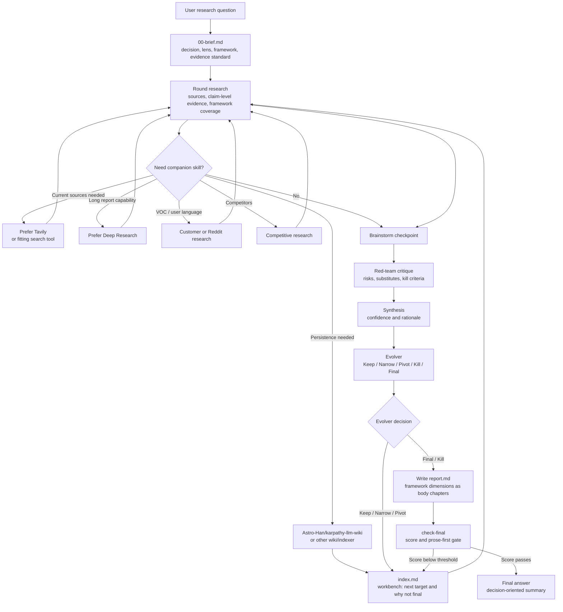

# Super Survey

Language: English | [中文](README.zh-CN.md) | [日本語](README.ja.md)

Super Survey is a reusable agent skill for multi-round product, market, technical, and open-source research. It turns a vague research target into evidence-backed Markdown artifacts with red-team critique, synthesis, and a sharper next-round question. It is designed for Skills-compatible agents and can also be used directly through its bundled CLI.

It focuses on three jobs:

- Turn vague questions into an executable research frame.
- Reduce gut-feel conclusions with evidence, red-team critique, and synthesis.
- Produce either a sharper next-round question or a final report at the end of each round.

## First Principles

1. The world is noisy, random, and not reliably predictable from an initial hunch. Every research task must avoid the trap of deciding first and then collecting evidence to support the decision.
2. A research report is written for human decision-makers, not as an agent task-audit log. Evidence trails, source registers, red-team notes, and quality checks are necessary, but they should support a readable judgment rather than replace it.

## What It Does

Super Survey is for decisions that should not stop at a link dump:

- product opportunity research
- competitor and market analysis
- open-source project scouting
- technical feasibility research
- investment-style diligence
- strategic exploration with adversarial critique

Each survey creates persistent artifacts:

```text
surveys/YYYY-MM-DD-topic-slug/
├── 00-brief.md
├── 01-research.md
├── 01-brainstorm.md
├── 01-redteam.md
├── 01-synthesis.md
├── 01-evolver.md
├── sources.jsonl
├── claims.jsonl
├── evidence.jsonl
├── index.md
├── report.md              # final-only; created after the stop gate passes
└── .super-survey.json
```

## Install

Install directly with the Skills CLI:

```bash
npx skills add GoatGit/super-survey
```

Codex users can also copy this repository into the Codex skills directory:

```bash
mkdir -p ~/.codex/skills
rsync -a --delete super-survey/ ~/.codex/skills/super-survey/
```

Then invoke it explicitly:

```text
$super-survey research whether an AI recruiting copilot is worth building
```

## CLI

Create a survey:

```bash
python3 scripts/survey_round.py init "AI recruiting agent" --language en
python3 scripts/survey_round.py init "AI 招聘助手" --language zh
python3 scripts/survey_round.py init "AI採用エージェント" --language ja
python3 scripts/survey_round.py init "formal market report" --mode deep
```

Create and check a round:

```bash
python3 scripts/survey_round.py round surveys/2026-06-13-ai-recruiting-agent 1
python3 scripts/survey_round.py check surveys/2026-06-13-ai-recruiting-agent
python3 scripts/survey_round.py check-final surveys/2026-06-13-ai-recruiting-agent
python3 scripts/survey_round.py upgrade-report surveys/2026-06-13-ai-recruiting-agent
```

Debug registry links directly:

```bash
python3 scripts/survey_round.py validate-evidence surveys/2026-06-13-ai-recruiting-agent
```

Command meanings:

- `check`: validates round artifacts, `index.md`, the evidence registry, companion-routing notes, and the latest raw evolver decision. It does not require `report.md`.
- `check-final`: runs the same checks plus final `report.md`, prose-first report rules, the mode-specific quality score recorded in `index.md`, and the requirement that the latest raw evolver decision is `Final` or `Kill`.
- `upgrade-report`: appends the full report schema to an older report. Older six-section reports are readable but do not pass the final gate; after upgrading, fill the new sections.
- `validate-evidence`: narrow debugging command for `sources.jsonl`, `claims.jsonl`, and `evidence.jsonl`; normal round validation uses `check` / `check-final`.

When the latest decision is `Keep`, `Narrow`, or `Pivot`, `check` can pass with a continuation warning so the next round can proceed without forcing a premature `Kill`. Round numbers must be positive integers.

## Modes And Evidence Registry

Choose the depth explicitly when speed or rigor matters:

| Mode | Use When | Minimum Registry | Report Gate |
|---|---|---:|---|
| `quick` | Directional scan or early triage | 1 source, 1 claim, 1 evidence item | score >=80 |
| `standard` | Default reusable research report | 3 sources, 3 claims, 3 evidence items | score >=90 |
| `deep` | Formal or high-stakes report, many citations, strict audit needs | 8 sources, 6 claims, 8 evidence items | score >=95 |

In `quick` mode, one combined `NN-round.md` can replace the five split round artifacts when it contains the essential research question, evidence and sources, brainstorming checkpoint, red-team challenge, synthesis, raw decision, and next step.

The lightweight registry keeps report prose readable while preserving auditability:

- `sources.jsonl`: `source_id`, `title`, `url`, `source_type`, `date_checked`, `credibility`
- `evidence.jsonl`: `evidence_id`, `source_id`, `quote_or_summary`, `locator`, `confidence`
- `claims.jsonl`: `claim_id`, `claim`, `supporting_evidence_ids`, `status`

Every evidence item must reference an existing source. Every supported, partial, or contested claim must reference existing evidence. The checker also catches duplicate IDs and obvious weak-support cases where a supported/partial claim does not match its linked evidence. Dense evidence tables belong in appendices or JSONL, not in the main report body.

Registry IDs such as `C1` and `E1` are for working files only. Final `report.md` must replace them with source titles, Markdown links, footnotes, or appendix references that include URLs, so the report can be read without opening the JSONL registry.

## skills.sh Readiness

This repository is structured for Skills CLI discovery and skills.sh indexing:

- root-level `SKILL.md` with `name` and `description` frontmatter
- `agents/openai.yaml` UI metadata
- bundled helper script under `scripts/`
- supporting references under `references/`
- MIT license, tests, and multilingual README files

Validate discovery:

```bash
npx skills add GoatGit/super-survey --list
```

## Research Frameworks

`Research lens` decides what evidence deserves emphasis. `Research framework` tells the reader how the whole survey systematically examines the question. Every survey should name a framework, list its dimensions, disclose weak or intentionally omitted dimensions, and use those dimensions as the structure for `00-brief.md`, each round artifact, and the final report.

This is the main writing rule: the framework is not an audit checklist at the end. `00-brief.md` defines the dimensions; `NN-research.md`, `NN-brainstorm.md`, `NN-redteam.md`, `NN-synthesis.md`, and `NN-evolver.md` each expand those same dimensions with Markdown subheadings. The final `report.md` then turns the dimensions into readable body chapters before appendices.

If evidence shows the framework should change, record it in `index.md` under `Framework Refinement Log`: current dimensions, evidence trigger for the change, and confirmation that the original question/core is preserved. Later rounds then use the refined dimensions. Silent framework drift is invalid.

Common starters:

| Survey type | Framework dimensions |
|---|---|
| Product opportunity | user pain, frequency, willingness to pay, substitutes, distribution, retention, trust/compliance, implementation difficulty |
| Market / competitor | demand, supply, competition, pricing, channels, switching cost, regulation, growth drivers |
| Technical feasibility | requirements, architecture, data/API access, performance, reliability, security, operations, maintenance |
| Open-source adoption | license, maintainer health, release cadence, issue response, API stability, ecosystem, alternatives, adoption risk |
| Investment / diligence | macro, industry, company, financial quality, valuation, catalysts, capital flows, risks |

For securities-style research, Super Survey can compose market, industry, and company frameworks: market view uses macro, liquidity, earnings, valuation, risk appetite, and fund flows; industry view uses demand, supply, competition, policy, technology, cycle, and valuation; company view uses business model, financial quality, growth, competitive advantage, valuation, catalysts, and risks. These are examples, not hard branches.

## Quality Gates

README gives the operational shape; the full agent checklist lives in `SKILL.md`.

There are three gates:

- `check` is the round gate. It validates artifacts, registry links and weak-support checks, framework coverage including explicit refinements, companion notes when required, and the latest raw evolver decision. It can pass with a continuation warning when the decision is `Keep`, `Narrow`, or `Pivot`.
- The evolver is the stop gate. `Keep`, `Narrow`, and `Pivot` mean create another round and update `index.md`; `Final` means the survey can move to final report writing; `Kill` means the current thesis should stop or switch away from desk research.
- `check-final` is the delivery gate. It requires a complete prose-first `report.md`, a passing mode score recorded in `index.md`, and the latest raw evolver decision to be `Final` or `Kill`.

Final delivery uses a 100-point quality gate recorded in `index.md`:

| Dimension | Points |
|---|---:|
| Problem and scope definition | 15 |
| Source, method, and framework quality | 20 |
| Evidence completeness | 20 |
| Analysis and red-team quality | 20 |
| Actionability | 15 |
| Structure and readability | 10 |

Mode thresholds are hard gates: `quick >=80`, `standard >=90`, and `deep >=95`. A final report below the selected threshold must continue another round focused on the weakest dimensions. The helper uses only the raw evolver decision plus the score threshold for stopping; it does not parse report prose such as "future disclosure" or "external validation" as a stopping rule.

The final report should read like a human memo: answer, framework dimension chapters, narrative, decision logic, recommendation, change triggers, next actions, and limits first; evidence registers, source quality, red-team notes, scenarios, and source inventory in appendices. Quality scoring belongs in `index.md` under the final report quality gate, not in `report.md`. Framework dimensions must appear as top-level Markdown headings in the body, not only in method notes or appendices. Citations must be standalone links or source references, not `C*` / `E*` registry IDs. A body dominated by bullets or audit tables does not pass.

Companion skills are optional helpers for search, long reports, VOC/customer research, competitor analysis, brainstorming, and wiki persistence. When current-source discovery matters, prefer `tavily-search` and record the search path or fallback. Prefer `deep-research` for formal long reports, many citations, HTML/PDF output, or strict citation validation when it is available. Use wiki persistence when long-term knowledge reuse is needed. Super Survey still owns the judgment loop.

## Workflow



## Inspiration: Karpathy's autoresearch

Super Survey's lightweight evolver is inspired by Andrej Karpathy's [autoresearch](https://github.com/karpathy/autoresearch), with respect and attribution. Autoresearch gives an AI agent a real training setup, lets it modify code, run short experiments, check whether a metric improved, keep or discard the change, and repeat.

Super Survey adapts that loop to product, market, technical, and open-source research:

| Dimension | Karpathy autoresearch | Super Survey evolver |
|---|---|---|
| Goal | Improve a model or code path through experiments | Sharpen a research thesis into an actionable decision |
| Input | Training code, fixed evaluation, experiment logs | Evidence, sources, constraints, red-team critique |
| Feedback | A comparable scalar metric such as validation loss | Structured judgment: evidence strength, risks, confidence |
| Decision | Keep or discard a code change | Keep, Narrow, Pivot, Kill, or finalize a thesis |
| Output | Better code/model plus experiment history | A narrower next-round research target plus evidence needs |

In short: autoresearch is metric-driven optimization; Super Survey is judgment-driven narrowing. When a survey has a measurable benchmark, Super Survey can borrow more of the autoresearch style. When the question is about buyer intent, compliance, distribution, or strategic risk, the loop stays evidence-first and decision-oriented instead of pretending every answer can be reduced to one number.

## Development

Run the test suite with the Python standard library:

```bash
python3 -m unittest discover -v
```

Run syntax validation:

```bash
python3 -m py_compile scripts/survey_round.py
```

The project intentionally keeps runtime dependencies to the Python standard library.

## Project Layout

```text
SKILL.md                         # agent skill instructions
scripts/survey_round.py           # survey artifact generator and validator
references/lightweight-evolver.md # evolver process reference
references/research-quality.md    # evidence and quality reference
agents/openai.yaml                # skill UI metadata
tests/                            # regression tests
```

## License

MIT. See [license.txt](license.txt).
