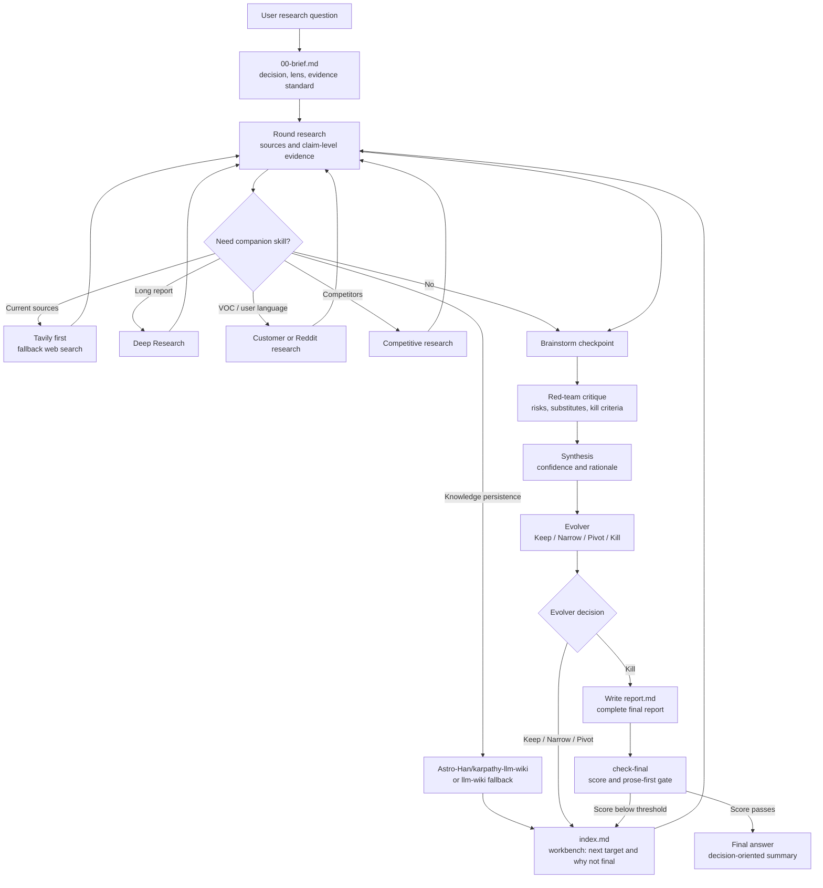

# Super Survey

Language: English | [中文](README.zh-CN.md) | [日本語](README.ja.md)

Super Survey is a reusable agent skill and research workflow for multi-round product, market, technical, and open-source research. It turns a vague research target into evidence-backed Markdown artifacts with red-team critique, synthesis, and a sharper next-round question. It is designed for Skills-compatible agents and can also be used directly through its bundled CLI.

## What It Does

Super Survey is for decisions that should not stop at a link dump:

- product opportunity research
- competitor and market analysis
- open-source project scouting
- technical feasibility research
- investment-style diligence
- strategic exploration with adversarial critique

Each survey creates persistent artifacts:

```text
surveys/YYYY-MM-DD-topic-slug/
├── 00-brief.md
├── 01-research.md
├── 01-brainstorm.md
├── 01-redteam.md
├── 01-synthesis.md
├── 01-evolver.md
├── sources.jsonl
├── claims.jsonl
├── evidence.jsonl
├── index.md
├── report.md              # final-only; created after the stop gate passes
└── .super-survey.json
```

## Install

Install directly with the Skills CLI:

```bash
npx skills add GoatGit/super-survey
```

Codex users can also copy this repository into the Codex skills directory:

```bash
mkdir -p ~/.codex/skills
rsync -a --delete super-survey/ ~/.codex/skills/super-survey/
```

Then invoke it explicitly:

```text
$super-survey research whether an AI recruiting copilot is worth building
```

## CLI

Create a survey:

```bash
python3 scripts/survey_round.py init "AI recruiting agent" --language en
python3 scripts/survey_round.py init "AI 招聘助手" --language zh
python3 scripts/survey_round.py init "AI採用エージェント" --language ja
python3 scripts/survey_round.py init "formal market report" --mode deep
```

Create and validate a round:

```bash
python3 scripts/survey_round.py round surveys/2026-06-13-ai-recruiting-agent 1
python3 scripts/survey_round.py validate-evidence surveys/2026-06-13-ai-recruiting-agent
python3 scripts/survey_round.py check surveys/2026-06-13-ai-recruiting-agent
python3 scripts/survey_round.py check-final surveys/2026-06-13-ai-recruiting-agent
python3 scripts/survey_round.py upgrade-report surveys/2026-06-13-ai-recruiting-agent
```

`check` validates round artifacts, `index.md`, the evidence registry, companion-routing notes, and the latest raw evolver decision. It does not require `report.md`. `check-final` validates the same round artifacts plus final `report.md`, prose-first report rules, and the mode-specific quality score. `validate-evidence` checks `sources.jsonl`, `claims.jsonl`, and `evidence.jsonl` directly. Round numbers must be positive integers. Older six-section reports are accepted by `check-final` with a warning; run `upgrade-report` to append the full report schema and then fill the new sections.

## Modes And Evidence Registry

Choose the depth explicitly when speed or rigor matters:

| Mode | Use When | Minimum Registry | Report Gate |
|---|---|---:|---|
| `quick` | Directional scan or early triage | 1 source, 1 claim, 1 evidence item | score >=80 |
| `standard` | Default reusable research report | 3 sources, 3 claims, 3 evidence items | score >=90 |
| `deep` | Formal or high-stakes report, many citations, strict audit needs | 8 sources, 6 claims, 8 evidence items | score >=95 |

The lightweight registry keeps report prose readable while preserving auditability:

- `sources.jsonl`: `source_id`, `title`, `url`, `source_type`, `date_checked`, `credibility`
- `evidence.jsonl`: `evidence_id`, `source_id`, `quote_or_summary`, `locator`, `confidence`
- `claims.jsonl`: `claim_id`, `claim`, `supporting_evidence_ids`, `status`

Every evidence item must reference an existing source. Every supported, partial, or contested claim must reference existing evidence. Dense evidence tables belong in appendices or JSONL, not in the main report body.

## skills.sh Readiness

This repository is structured for Skills CLI discovery and skills.sh indexing:

- root-level `SKILL.md` with `name` and `description` frontmatter
- `agents/openai.yaml` UI metadata
- bundled helper script under `scripts/`
- supporting references under `references/`
- MIT license, tests, and multilingual README files

Validate discovery:

```bash
npx skills add GoatGit/super-survey --list
```

## Quality Gates

A complete round must include:

- current target and decision criteria
- a research lens and decision evidence standard that guide source selection without forcing a narrow category
- current claim-level evidence with source type, freshness, confidence, contradictions, and search tool used
- a brainstorming checkpoint
- findings separated from interpretation
- red-team critique with substitutes, alternative explanations, and kill criteria checked
- synthesis with confidence, decision rationale, and unknowns
- lightweight evolver output with `Keep / Narrow / Pivot / Kill`
- explicit continue/stop decision driven by the latest evolver decision and final report quality, not a fixed round count
- updated `index.md` as the per-round workbench: current thesis, best conclusion, round ledger, continuation status, next target, why not final yet, sources, wiki status, and decision log
- standalone `report.md` only after the stop gate passes: readable narrative first, appendices for evidence/source/method/red-team/scenario details second

Final `report.md` uses a 100-point quality gate:

| Dimension | Points |
|---|---:|
| Problem and scope definition | 15 |
| Source and method quality | 20 |
| Evidence completeness | 20 |
| Analysis and red-team quality | 20 |
| Actionability | 15 |
| Structure and readability | 10 |

Mode thresholds are hard gates: `quick >=80`, `standard >=90`, and `deep >=95`. A final report below the selected threshold must continue another round focused on the weakest dimensions.

The final report should read like a human memo, not an audit table. Start with the answer, reader's path, main narrative, decision logic, recommendation, change triggers, next actions, and limits. Put evidence registers, source quality, red-team notes, scenarios, quality score, and source inventory in appendices so rigor is preserved without breaking readability.

The evolver runs before final report writing. It is a round-level gate that converts the latest synthesis and red-team critique into `Keep / Narrow / Pivot / Kill` plus a sharper next-round focus. If the evolver says `Keep`, `Narrow`, or `Pivot`, continue another round and update `index.md`; do not draft `report.md` yet. If the evolver says `Kill`, write the final report, score it, and run `check-final`. A survey may stop only when both raw gates pass: the final report meets the selected mode threshold, and the latest evolver decision is `Kill`. The helper does not use `report.md` prose such as "future disclosure" or "external validation" to override the raw evolver decision.

Wiki persistence is a required attempt for every completed survey round. Prefer `karpathy-llm-wiki` / `Astro-Han/karpathy-llm-wiki`; fall back to local `llm-wiki`, then `pin-llm-wiki` when project config exists, then another indexer, then Markdown-only `index.md`. `index.md` must record `Wiki Tool Attempted`, `Wiki Ingest Result`, `Wiki Fallback Reason`, and `Wiki Artifact Path`.

Super Survey can route subtasks to optional companion skills for search, deep reports, VOC/customer research, competitor analysis, brainstorming, and wiki persistence. For current-source discovery, it should try `tavily-search` first and document any fallback. These companions gather or package evidence; Super Survey remains responsible for the final judgment loop.

`deep-research` is the preferred companion when the user asks for a formal long report, many citations, HTML/PDF output, strict citation validation, or publication-style source audit. In that workflow, deep-research handles evidence persistence and long-report packaging; Super Survey still owns red-team critique, the evolver decision, and final decision convergence.

## Workflow



## Inspiration: Karpathy's autoresearch

Super Survey's lightweight evolver is inspired by Andrej Karpathy's [autoresearch](https://github.com/karpathy/autoresearch), with respect and attribution. Autoresearch gives an AI agent a real training setup, lets it modify code, run short experiments, check whether a metric improved, keep or discard the change, and repeat.

Super Survey adapts that loop to product, market, technical, and open-source research:

| Dimension | Karpathy autoresearch | Super Survey evolver |
|---|---|---|
| Goal | Improve a model or code path through experiments | Sharpen a research thesis into an actionable decision |
| Input | Training code, fixed evaluation, experiment logs | Evidence, sources, constraints, red-team critique |
| Feedback | A comparable scalar metric such as validation loss | Structured judgment: evidence strength, risks, confidence |
| Decision | Keep or discard a code change | Keep, Narrow, Pivot, or Kill a thesis |
| Output | Better code/model plus experiment history | A narrower next-round research target plus evidence needs |

In short: autoresearch is metric-driven optimization; Super Survey is judgment-driven narrowing. When a survey has a measurable benchmark, Super Survey can borrow more of the autoresearch style. When the question is about buyer intent, compliance, distribution, or strategic risk, the loop stays evidence-first and decision-oriented instead of pretending every answer can be reduced to one number.

## Development

Run the test suite with the Python standard library:

```bash
python3 -m unittest discover -v
```

Run syntax validation:

```bash
python3 -m py_compile scripts/survey_round.py
```

The project intentionally keeps runtime dependencies to the Python standard library.

## Project Layout

```text
SKILL.md                         # agent skill instructions
scripts/survey_round.py           # survey artifact generator and validator
references/lightweight-evolver.md # evolver process reference
references/research-quality.md    # evidence and quality reference
agents/openai.yaml                # skill UI metadata
tests/                            # regression tests
```

## License

MIT. See [license.txt](license.txt).
