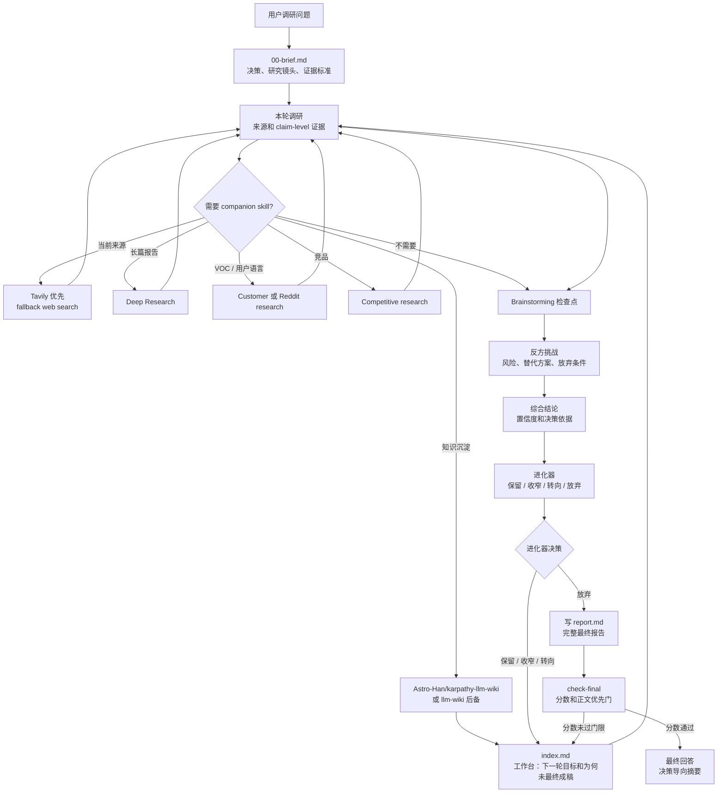

# Super Survey

语言：[English](README.md) | 中文 | [日本語](README.ja.md)

Super Survey 是一个可复用的 agent skill 和调研工作流，用于多轮产品、市场、技术和开源项目调研。它把模糊问题转化为有证据、反方挑战、综合判断和下一轮更具体问题的 Markdown 产物。它面向兼容 Skills 的 agent，也可以直接通过内置 CLI 使用。

## 第一性原理

世界是随机、嘈杂、不可可靠预测的，初始直觉很容易只是偏见或不完整信息。Super Survey 以这个前提为基础：所有调研任务都必须避免“先下结论，后找论据”的陷阱。

这个工作流要求结论在证据、矛盾信息、反方挑战、综合判断和原始进化器决策都落盘之前保持暂定。`00-brief.md` 只定义决策框架和继续策略，不能预测轮数，也不能预写结论。

## 项目用途

Super Survey 适合不应停留在链接收集的决策：

- 产品机会调研
- 竞品和市场分析
- GitHub/开源项目筛选
- 技术可行性判断
- 投资/尽调式研究
- 需要反方挑战的战略探索

每次调研会生成：

```text
surveys/YYYY-MM-DD-topic-slug/
├── 00-brief.md
├── 01-research.md
├── 01-brainstorm.md
├── 01-redteam.md
├── 01-synthesis.md
├── 01-evolver.md
├── sources.jsonl
├── claims.jsonl
├── evidence.jsonl
├── index.md
├── report.md              # 仅最终产物；停止门通过后创建
└── .super-survey.json
```

## 安装

用 Skills CLI 直接安装：

```bash
npx skills add GoatGit/super-survey
```

Codex 用户也可以复制到 Codex skills 目录：

```bash
mkdir -p ~/.codex/skills
rsync -a --delete super-survey/ ~/.codex/skills/super-survey/
```

显式调用：

```text
$super-survey 调研 AI 招聘助手是否值得做
```

## 命令行

创建调研：

```bash
python3 scripts/survey_round.py init "AI recruiting agent" --language en
python3 scripts/survey_round.py init "AI 招聘助手" --language zh
python3 scripts/survey_round.py init "AI採用エージェント" --language ja
python3 scripts/survey_round.py init "正式市场报告" --mode deep
```

创建并检查一轮：

```bash
python3 scripts/survey_round.py round surveys/2026-06-13-ai-招聘助手 1
python3 scripts/survey_round.py validate-evidence surveys/2026-06-13-ai-招聘助手
python3 scripts/survey_round.py check surveys/2026-06-13-ai-招聘助手
python3 scripts/survey_round.py check-final surveys/2026-06-13-ai-招聘助手
python3 scripts/survey_round.py upgrade-report surveys/2026-06-13-ai-招聘助手
```

`check` 校验轮次产物、`index.md`、证据登记、companion routing 记录和最新进化器原始决策。它不要求 `report.md`；当最新决策是 `保留`、`收窄` 或 `转向` 时，它可以带继续提示通过，方便进入下一轮，而不是诱导 agent 过早改成 `放弃`。`check-final` 校验同一批轮次产物，并额外校验最终 `report.md`、正文优先规则、对应模式的质量分，以及最新进化器原始决策必须是 `放弃`。`validate-evidence` 会直接检查 `sources.jsonl`、`claims.jsonl` 和 `evidence.jsonl`。轮次必须是正整数。旧的六章节报告可读，但不能通过最终门；运行 `upgrade-report` 可追加完整报告 schema，然后需要补全新章节内容。

## 模式与证据登记

当速度或严谨性很重要时，显式选择深度：

| 模式 | 适用场景 | 最低登记要求 | 报告门限 |
|---|---|---:|---|
| `quick` | 方向性扫描或早期筛选 | 1 个来源、1 个主张、1 条证据 | 分数 >=80 |
| `standard` | 默认可复用调研报告 | 3 个来源、3 个主张、3 条证据 | 分数 >=90 |
| `deep` | 正式/高风险报告、大量引用、严格审计 | 8 个来源、6 个主张、8 条证据 | 分数 >=95 |

轻量证据登记表让报告正文保持可读，同时保留可审计性：

- `sources.jsonl`: `source_id`, `title`, `url`, `source_type`, `date_checked`, `credibility`
- `evidence.jsonl`: `evidence_id`, `source_id`, `quote_or_summary`, `locator`, `confidence`
- `claims.jsonl`: `claim_id`, `claim`, `supporting_evidence_ids`, `status`

每条 evidence 必须引用已存在的 source。每个 supported、partial 或 contested claim 必须引用已存在的 evidence。密集证据表应放在附录或 JSONL 中，不应放在报告正文。

## skills.sh 收录准备

这个仓库已按 Skills CLI 发现和 skills.sh 索引的方式组织：

- 根目录 `SKILL.md`，包含 `name` 和 `description` frontmatter
- `agents/openai.yaml` UI 元数据
- `scripts/` 下的辅助脚本
- `references/` 下的参考资料
- MIT 许可证、测试和多语言 README 文件

验证发现能力：

```bash
npx skills add GoatGit/super-survey --list
```

## 质量门

完整的一轮必须包含：

- 当前调研目标和决策标准
- 研究镜头和决策证据标准，用来指导来源选择，但不把调研硬塞进狭窄类别
- claim-level 证据，并记录来源类型、新鲜度、置信度、矛盾证据和使用的搜索工具
- brainstorming 检查点
- 发现与解释分离
- 包含替代方案、替代解释和已检查放弃条件的反方挑战
- 带置信度、决策依据和未知项的综合结论
- 轻量进化器输出，并明确 `保留 / 收窄 / 转向 / 放弃`
- 明确继续/停止决策，并由最新进化器决策和最终报告质量驱动，而不是由固定轮数或预写结论驱动
- 更新后的 `index.md`，作为每轮工作台：当前论点、当前证据约束结论、轮次台账、继续状态、下一轮目标、为何尚未最终成稿、来源、wiki 状态和决策日志
- 仅在停止门通过后生成独立的 `report.md`：先写可通畅阅读的正文，再把证据/来源/方法/反方/情景等审计材料放到附录

最终 `report.md` 使用 100 分质量门：

| 维度 | 分值 |
|---|---:|
| 问题与范围定义 | 15 |
| 来源与方法质量 | 20 |
| 证据完整性 | 20 |
| 分析与反方挑战质量 | 20 |
| 可行动性 | 15 |
| 结构与可读性 | 10 |

模式门限是硬门：`quick >=80`、`standard >=90`、`deep >=95`。最终报告低于所选模式门限时，必须围绕最低分维度继续下一轮。

最终门通过后，最终报告应该像人类写的判断备忘录，而不是审计表。正文先给答案、阅读路径、正文叙事、决策逻辑、最终建议、改变结论的触发条件、下一步行动和报告边界；证据登记表、来源质量、反方挑战、情景分析、质量分和来源清单放在附录里。这样保留严谨性，但不牺牲可读性。

进化器在最终报告写作之前运行。它是轮次级门限，负责把最新综合结论和反方挑战转成 `保留 / 收窄 / 转向 / 放弃`，并产出更锋利的下一轮焦点。如果进化器给出 `保留`、`收窄` 或 `转向`，必须继续下一轮并更新 `index.md`，不要先写 `report.md`。如果进化器给出 `放弃`，再写最终报告、评分并运行 `check-final`。调研只有在两个原始门都通过时才可以停止：最终报告达到所选模式门限，且最新进化器决策是 `放弃`。helper 不使用 `report.md` 里的“未来披露”或“外部验证”等解释性文字来覆盖进化器原始决策。

每个完成的调研轮次都必须尝试 wiki 持久化。优先使用 `karpathy-llm-wiki` / `Astro-Han/karpathy-llm-wiki`；其次回退到本地 `llm-wiki`；若项目已有配置再用 `pin-llm-wiki`；再不行用其他 indexer；最后才是 Markdown-only `index.md`。`index.md` 必须记录 `Wiki Tool Attempted`、`Wiki Ingest Result`、`Wiki Fallback Reason` 和 `Wiki Artifact Path`。

Super Survey 可以把搜索、深度报告、VOC/客户研究、竞品分析、brainstorming 和 wiki 沉淀等子任务路由给可选 companion skills。当前来源发现应优先尝试 `tavily-search`，并记录任何 fallback。这些 companion 负责收集或包装证据；最终判断闭环仍由 Super Survey 负责。

当用户要求正式长报告、大量引用、HTML/PDF 输出、严格 citation 校验，或出版级来源审计时，`deep-research` 是首选 companion。这个流程里，deep-research 负责证据持久化和长报告包装；Super Survey 仍负责反方挑战、进化器决策和最终决策收敛。

## 调用流程



## 灵感来源：Karpathy 的 autoresearch

Super Survey 的轻量进化器受到 Andrej Karpathy 的 [autoresearch](https://github.com/karpathy/autoresearch) 启发，并向这个思路致敬。autoresearch 的核心是让 AI agent 在真实训练环境中修改代码、短跑实验、检查指标是否改善、保留或丢弃改动，然后继续循环。

Super Survey 把这个循环改造到产品、市场、技术和开源调研里：

| 维度 | Karpathy autoresearch | Super Survey 进化器 |
|---|---|---|
| 目标 | 通过实验改进模型或代码路径 | 把调研论点推进到可行动决策 |
| 输入 | 训练代码、固定评测、实验日志 | 证据、来源、约束、反方挑战 |
| 反馈 | 可比较的单一指标，例如 validation loss | 结构化判断：证据强度、风险、置信度 |
| 决策 | 保留或丢弃代码改动 | 保留、收窄、转向或放弃论点 |
| 输出 | 更好的代码/模型和实验历史 | 更窄的下一轮调研目标和所需证据 |

简言之：autoresearch 是指标驱动的优化；Super Survey 是判断驱动的收窄。当调研对象有明确 benchmark 时，Super Survey 可以更接近 autoresearch 的方式；当问题涉及买方意愿、合规、分发或战略风险时，它会保持证据优先和决策导向，而不是假装所有问题都能压成一个数字。

## 开发

运行测试：

```bash
python3 -m unittest discover -v
```

运行语法检查：

```bash
python3 -m py_compile scripts/survey_round.py
```

项目运行时只依赖 Python 标准库。

## 目录结构

```text
SKILL.md                         # agent skill 说明
scripts/survey_round.py           # 调研产物生成器和校验器
references/lightweight-evolver.md # 轻量进化器流程
references/research-quality.md    # 证据质量参考
agents/openai.yaml                # 技能 UI 元数据
tests/                            # 回归测试
```

## 许可证

MIT。见 [license.txt](license.txt)。
