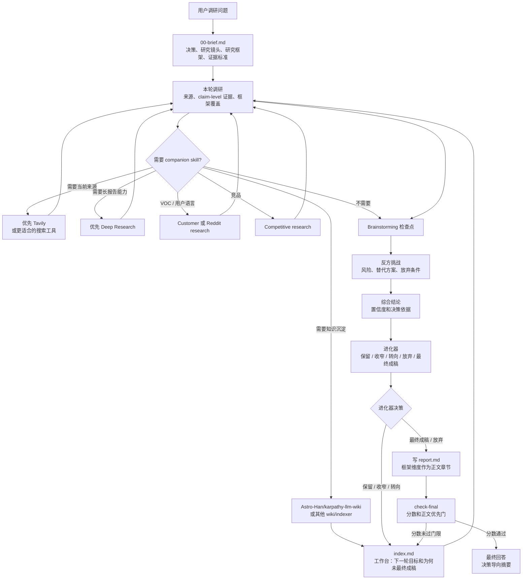

# Super Survey

语言：[English](README.md) | 中文 | [日本語](README.ja.md)

Super Survey 是一个可复用的 agent skill，用于多轮产品、市场、技术和开源项目调研。它把模糊问题转化为有证据、反方挑战、综合判断和下一轮更具体问题的 Markdown 产物。它面向兼容 Skills 的 agent，也可以直接通过内置 CLI 使用。

它重点解决三件事：

- 把模糊问题变成可执行的调研框架。
- 用证据、反方挑战和综合判断减少拍脑袋结论。
- 在每一轮结束时产出更清晰的下一轮问题或最终报告。

## 第一性原理

1. 世界是随机、嘈杂、不可可靠预测的，初始直觉很容易只是偏见或不完整信息。所有调研任务都必须避免“先下结论，后找论据”的陷阱。
2. 调研报告是写给人类决策者看的判断报告，不是智能体的任务审计日志。证据链、来源登记、反方挑战和质量检查都必须存在，但它们应当支撑可读的判断，而不是取代判断本身。
3. 用户问题是初始点，不是目标函数。Super Survey 会先检查用户的提问框架、隐含假设和真正要优化的目标，再开始找证据或收敛结论。

## 项目用途

Super Survey 适合不应停留在链接收集的决策：

- 产品机会调研
- 竞品和市场分析
- GitHub/开源项目筛选
- 技术可行性判断
- 投资/尽调式研究
- 需要反方挑战的战略探索

每次调研会生成：

```text
surveys/YYYY-MM-DD-topic-slug/
├── 00-brief.md
├── 01-research.md
├── 01-brainstorm.md
├── 01-redteam.md
├── 01-synthesis.md
├── 01-evolver.md
├── sources.jsonl
├── claims.jsonl
├── evidence.jsonl
├── index.md
├── report.md              # 仅最终产物；停止门通过后创建
└── .super-survey.json
```

## 安装

用 Skills CLI 直接安装：

```bash
npx skills add GoatGit/super-survey
```

Codex 用户也可以复制到 Codex skills 目录：

```bash
mkdir -p ~/.codex/skills
rsync -a --delete super-survey/ ~/.codex/skills/super-survey/
```

显式调用：

```text
$super-survey 调研 AI 招聘助手是否值得做
```

## 命令行

创建调研：

```bash
python3 scripts/survey_round.py init "AI recruiting agent" --language en
python3 scripts/survey_round.py init "AI 招聘助手" --language zh
python3 scripts/survey_round.py init "AI採用エージェント" --language ja
python3 scripts/survey_round.py init "正式市场报告" --mode deep
```

创建并检查一轮：

```bash
python3 scripts/survey_round.py round surveys/2026-06-13-ai-招聘助手 1
python3 scripts/survey_round.py check surveys/2026-06-13-ai-招聘助手
python3 scripts/survey_round.py check-final surveys/2026-06-13-ai-招聘助手
python3 scripts/survey_round.py upgrade-report surveys/2026-06-13-ai-招聘助手
```

单独调试证据登记链接：

```bash
python3 scripts/survey_round.py validate-evidence surveys/2026-06-13-ai-招聘助手
```

命令含义：

- `check`：检查轮次产物、`index.md`、证据登记、companion routing 记录和最新进化器原始决策。它不要求 `report.md`。
- `check-final`：在 `check` 的基础上，额外检查最终 `report.md`、正文优先规则、记录在 `index.md` 的对应模式质量分，以及最新进化器原始决策必须是 `最终成稿` 或 `放弃`。
- `upgrade-report`：把旧报告追加为完整 report schema。旧的六章节报告可读，但不能通过最终门，升级后还需要补全新章节内容。
- `validate-evidence`：只用于专项调试 `sources.jsonl`、`claims.jsonl` 和 `evidence.jsonl`；正常轮次校验使用 `check` / `check-final`。

当最新决策是 `保留`、`收窄` 或 `转向` 时，`check` 可以带继续提示通过，方便进入下一轮，而不是诱导 agent 过早改成 `放弃`。轮次必须是正整数。

## 模式与证据登记

当速度或严谨性很重要时，显式选择深度：

| 模式 | 适用场景 | 最低登记要求 | 报告门限 |
|---|---|---:|---|
| `quick` | 方向性扫描或早期筛选 | 1 个来源、1 个主张、1 条证据 | 分数 >=80 |
| `standard` | 默认可复用调研报告 | 3 个来源、3 个主张、3 条证据 | 分数 >=90 |
| `deep` | 正式/高风险报告、大量引用、严格审计 | 8 个来源、6 个主张、8 条证据 | 分数 >=95 |

在 `quick` 模式下，如果 `NN-round.md` 已包含本轮问题、证据与来源、brainstorming 检查点、反方挑战、综合结论、原始决策和下一步，它可以替代五个拆分轮次产物。

轻量证据登记表让报告正文保持可读，同时保留可审计性：

- `sources.jsonl`: `source_id`, `title`, `url`, `source_type`, `date_checked`, `credibility`
- `evidence.jsonl`: `evidence_id`, `source_id`, `quote_or_summary`, `locator`, `confidence`
- `claims.jsonl`: `claim_id`, `claim`, `supporting_evidence_ids`, `status`

每条 evidence 必须引用已存在的 source。每个 supported、partial 或 contested claim 必须引用已存在的 evidence。检查器也会拦截重复 ID，以及 supported/partial 主张与所链接证据明显不匹配的弱支撑情况。密集证据表应放在附录或 JSONL 中，不应放在报告正文。

`C1`、`E1` 这类 registry ID 只用于过程文件。最终 `report.md` 必须把它们替换成来源标题、Markdown 链接、脚注，或包含 URL 的附录引用，这样报告不需要打开 JSONL 登记表也能独立阅读。

## skills.sh 收录准备

这个仓库已按 Skills CLI 发现和 skills.sh 索引的方式组织：

- 根目录 `SKILL.md`，包含 `name` 和 `description` frontmatter
- `agents/openai.yaml` UI 元数据
- `scripts/` 下的辅助脚本
- `references/` 下的参考资料
- MIT 许可证、测试和多语言 README 文件

验证发现能力：

```bash
npx skills add GoatGit/super-survey --list
```

## 研究框架

`研究镜头` 决定哪些证据需要被重点关注；`研究框架` 告诉读者整个调研按什么方法系统展开。每次调研都应写明采用的框架、框架维度，以及哪些维度薄弱或被有意排除，并把这些维度作为 `00-brief.md`、每轮过程产物和最终报告的共同结构。

选择研究框架前，先做一次反迎合建模。把用户措辞拆成已知事实、未验证假设、主观判断、缺失信息和关键利益相关方；再把目标重述成决策问题。这样可以避免调研直接优化用户的初始表述、被改写成更容易放弃的强命题，或收敛到一个顺耳但没有回答真实决策的问题。

这是最重要的写作规则：研究框架不是最后补一个审计清单。`00-brief.md` 定义维度；`NN-research.md`、`NN-brainstorm.md`、`NN-redteam.md`、`NN-synthesis.md` 和 `NN-evolver.md` 都要用同一组维度作为 Markdown 子标题展开。最终 `report.md` 再把这些维度写成附录之前的可读正文章节。

如果证据表明框架需要调整，必须在 `index.md` 的 `框架修正日志` 中记录当前维度、变更的证据触发，以及原始问题/核心仍被保留。后续轮次按修正后的维度展开。静默漂移框架无效。

常用起点：

| 调研类型 | 框架维度 |
|---|---|
| 产品机会 | 用户痛点、频率、付费意愿、替代方案、分发、留存、信任/合规、实现难度 |
| 市场/竞品 | 需求、供给、竞争、定价、渠道、切换成本、监管、增长驱动 |
| 技术可行性 | 需求约束、架构路径、数据/API 访问、性能、可靠性、安全、运维、维护成本 |
| 开源采用 | 许可证、维护者健康度、发布节奏、issue 响应、API 稳定性、生态、替代品、采用风险 |
| 投资/尽调 | 宏观、行业、公司、财务质量、估值、催化、资金行为、风险 |

证券类调研可以组合市场、行业和公司框架：市场研判看宏观、流动性、盈利、估值、风险偏好和资金行为；行业研究看需求、供给、竞争、政策、技术、周期和估值；个股研究看商业模式、财务质量、成长性、竞争优势、估值、催化和风险。这些是示例，不是硬分流。

## 质量门

README 只说明操作形状；完整 agent 检查清单位于 `SKILL.md`。

这里有三道门：

- `check` 是轮次门：检查轮次产物、证据登记链接和弱支撑、研究框架覆盖及显式修正、必要的 companion 记录和最新进化器原始决策。当决策是 `保留`、`收窄` 或 `转向` 时，它可以带继续提示通过。
- 进化器是停止门：`保留`、`收窄`、`转向` 表示创建下一轮并更新 `index.md`；`最终成稿` 表示可以进入最终报告写作；`放弃` 表示当前论点应停止或转向非桌面研究验证。
- `check-final` 是交付门：要求完整的正文优先 `report.md`、`index.md` 中记录的质量分通过对应模式门限，并且最新进化器原始决策是 `最终成稿` 或 `放弃`。

最终交付使用记录在 `index.md` 中的 100 分质量门：

| 维度 | 分值 |
|---|---:|
| 问题与范围定义 | 15 |
| 来源、方法与研究框架质量 | 20 |
| 证据完整性 | 20 |
| 分析与反方挑战质量 | 20 |
| 可行动性 | 15 |
| 结构与可读性 | 10 |

模式门限是硬门：`quick >=80`、`standard >=90`、`deep >=95`。最终报告低于所选模式门限时，必须围绕最低分维度继续下一轮。helper 只用进化器原始决策和质量分门限判断是否停止，不把 `report.md` 里的“未来披露”或“外部验证”等解释性文字当成停止规则。

最终报告应该像人类写的判断备忘录：先给答案、框架维度正文章节、正文叙事、决策逻辑、最终建议、改变结论的触发条件、下一步行动和报告边界；证据登记表、来源质量、反方挑战、情景分析和来源清单放在附录里。质量分记录在 `index.md` 的最终报告质量门中，不写入 `report.md`。框架维度必须以顶层 Markdown 标题出现在正文里，不能只停留在方法说明或附录审计内容中。引用必须是可独立阅读的来源链接或来源说明，不能是 `C*` / `E*` registry ID。正文如果被项目符号或审计表格主导，不能通过最终门。

Companion skills 是可选助手，可用于搜索、长报告、VOC/客户研究、竞品分析、brainstorming 和 wiki 沉淀。当需要当前来源发现时，优先考虑 `tavily-search`，并记录搜索路径或 fallback。正式长报告、大量引用、HTML/PDF 输出或严格 citation 校验可优先使用可用的 `deep-research`。只有需要长期知识复用时才启用 wiki 沉淀。最终判断闭环仍由 Super Survey 负责。

## 调用流程



## 灵感来源：Karpathy 的 autoresearch

Super Survey 的轻量进化器受到 Andrej Karpathy 的 [autoresearch](https://github.com/karpathy/autoresearch) 启发，并向这个思路致敬。autoresearch 的核心是让 AI agent 在真实训练环境中修改代码、短跑实验、检查指标是否改善、保留或丢弃改动，然后继续循环。

Super Survey 把这个循环改造到产品、市场、技术和开源调研里：

| 维度 | Karpathy autoresearch | Super Survey 进化器 |
|---|---|---|
| 目标 | 通过实验改进模型或代码路径 | 把调研论点推进到可行动决策 |
| 输入 | 训练代码、固定评测、实验日志 | 证据、来源、约束、反方挑战 |
| 反馈 | 可比较的单一指标，例如 validation loss | 结构化判断：证据强度、风险、置信度 |
| 决策 | 保留或丢弃代码改动 | 保留、收窄、转向、放弃或最终成稿 |
| 输出 | 更好的代码/模型和实验历史 | 更窄的下一轮调研目标和所需证据 |

简言之：autoresearch 是指标驱动的优化；Super Survey 是判断驱动的收窄。当调研对象有明确 benchmark 时，Super Survey 可以更接近 autoresearch 的方式；当问题涉及买方意愿、合规、分发或战略风险时，它会保持证据优先和决策导向，而不是假装所有问题都能压成一个数字。

## 开发

运行测试：

```bash
python3 -m unittest discover -v
```

运行语法检查：

```bash
python3 -m py_compile scripts/survey_round.py
```

项目运行时只依赖 Python 标准库。

## 目录结构

```text
SKILL.md                         # agent skill 说明
scripts/survey_round.py           # 调研产物生成器和校验器
references/lightweight-evolver.md # 轻量进化器流程
references/research-quality.md    # 证据质量参考
agents/openai.yaml                # 技能 UI 元数据
tests/                            # 回归测试
```

## 许可证

MIT。见 [license.txt](license.txt)。
